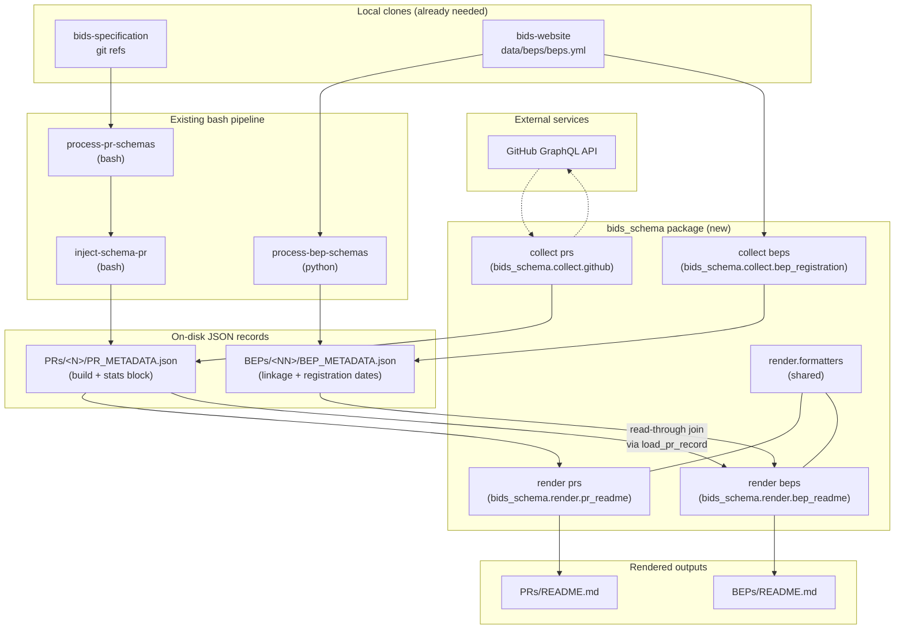

# Extended PR & BEP statistics — consolidated implementation plan

Author: consolidated from five parallel design perspectives
Status: revised after independent review (v2)
Related: `doc/designs/1-BEP-support-design-plan.md`, `AGENTS.md`

## Revision history

- **v1** — initial consolidation of 5 subagent perspectives.
- **v2** — addressed reviewer blockers B1 (wrong claim about `gh pr view --json reviewThreads`), B2 (missing pagination handling), B3 (`datalad run` cleanliness between per-PR calls); and should-fix items S1 (single-file storage), S2 (freshness on force-push), S3 (distinguish "not implemented" from `null`), S4 (split PR#2 into ship-vs-onboard), S5 (deprecation window for accidental BEP-side copy).
- **v3** — maintainer feedback pass. Added author-level breakdowns for
  reviews, comments, and unresolved threads (§1, §2.1, §3.1). Dropped
  Google-Doc comment/suggestion collection entirely from the near-term
  schema (§2.2) — schema v2 covers only doc creation/modification dates;
  suggestion + comment counts move to a schema v3 addition in a later
  PR. Removed `_capabilities` (per maintainer: it's about tooling, not
  data). Restructured tools as a small `bids_schema` Python package with
  a `click` CLI, no PyPI (§3, §9). Data-flow diagram converted to
  mermaid (§4). Rethought Google-Docs auth requirements per maintainer
  pushback (§6, §11). Added PR #0 for the top-level `AGENTS.md` /
  `CLAUDE.md` / `README.md` groundwork. Emphasised separation of
  collection and rendering as a first-class invariant (§1, §5, §7).
- **v3.1** — added `last_state` and `effective_state` per reviewer
  (§2.1, §3.5). A histogram alone doesn't tell you the reviewer's
  current standing; `effective_state` matches GitHub's own reviewers-sidebar
  heuristic (latest non-COMMENTED, non-DISMISSED submission).
- **v3.2** — dropped all Google-Docs API work from scope. Replaced
  with two `git log`-derived timestamps against the `bids-website`
  clone we already have: `bep_registered` (commit that first
  introduced the BEP entry in `data/beps/beps.yml`) and
  `googledoc_registered` (commit that first attached a `google_doc`
  URL to that entry). No external auth, no GCP, no onboarding.
  Related sections trimmed (§2.2, §3.6, §6, §7, §9, §11).
- **v3.3** — maintainer answered all remaining §11 questions: CLI
  name `bids-schema` accepted; `pip install -e '.[ci]'` in workflow
  accepted; BEP-registration collector does its own `git fetch` on
  `$BIDS_WEBSITE_REPO`. §3.6 updated with the fetch policy. No
  blocking questions remain — PR #1 is ready to start.

## 1. Goal

Enrich the auto-generated `PRs/README.md` and `BEPs/README.md` tables with
activity signals that a maintainer can act on:

For every open PR with schema changes:

- First & last commit dates on the PR branch (activity window)
- Current review counts split by state: `APPROVED`, `COMMENTED`, `CHANGES_REQUESTED`
  - in underlying metadata record also record review author github handles for dates for the reviews
- Comment window (first & last comment date)
  - in underlying metadata record, record stats over comment authors and dates (earliest/latest) and count per author
- Total comment count (issue comments + review-thread comments)
- Number of unresolved inline review discussions
  - in underlying metadata record similar to regular comments info on authors / counts

For every BEP entry in `bids-website:data/beps/beps.yml`, additionally:

- `bep_registered` — commit date when the BEP entry was first added
  to `beps.yml`.
- `googledoc_registered` — commit date when a `google_doc` URL was
  first attached to that BEP entry (may equal `bep_registered`, may
  be later, may be `null` if no `google_doc` URL was ever set).

**Google Docs API access is out of scope** for this design. Direct
interrogation (edit dates, open comment counts, unresolved suggestion
counts) requires a GCP project, service-account credentials, per-doc
share invitations, and ongoing operational overhead — a
disproportionate investment for the value at this stage. If this
becomes desirable later, a separate design doc can pick it up.

**Non-negotiable invariant 1 — collect once.** PR-derived facts are
collected **exactly once**, in the PR pipeline. The BEP pipeline never
re-collects them; the BEP renderer joins to the sibling
`PRs/<N>/PR_METADATA.json` at render time.

**Non-negotiable invariant 2 — collection ⟂ rendering.** The three
concerns (data model = JSON on disk; collection/update operations
that populate it; rendering from JSON to Markdown) must be cleanly
separable. It must be possible to re-render both READMEs without
triggering any HTTP call, and it must be possible to run collection
without re-rendering. Typical cron flow is *collect → render*, but the
two are independently invocable commands (see §3, §5).

## 2. Storage model — single file per entity, with nested `stats` block

**Revised from v1.** The reviewer's push against the two-file split is
persuasive at this repo's scale (~50 PRs, ~12 BEPs, no external consumers on
a stats-sensitive cadence). Keep one file per entity and land the new
network-derived data as a nested `stats` block, updated by a Python writer
via atomic read-modify-write. This also simplifies §5 (one `datalad run`
per phase, not per-PR) and avoids the dirty-tree failure mode the reviewer
called out (B3).

```
PRs/<N>/PR_METADATA.json     # existing fields + new `stats` block (see §2.1)
BEPs/<NN>/BEP_METADATA.json  # existing fields + new registration timestamps (see §2.2)
```

**Rationale**:

- **Fewer files, fewer diff-line-noise commits per cron tick.** One
  `datalad run` per cycle rewrites all `PRs/*/PR_METADATA.json` at once.
- **Isolation is achieved by writer discipline**, not filesystem
  separation: the stats collector reads the current JSON, updates only the
  `stats` sub-tree, writes back atomically. A failed HTTP call for one PR
  writes `stats._error` on that record and leaves the build fields alone.
- **Bash stays out of the JSON we care about.** The heredoc + `sed`-escape
  hack in `inject-schema-pr` is not extended. The stats writer is pure
  Python and merges into the file the bash script produced.
- **The BEP-side accidental copy is dealt with separately** — see §8.

### 2.1 `PR_METADATA.json` v2 schema

Additive: existing keys unchanged, one new top-level object `stats`.

```json
{
  "_schema_version": 2,
  "pr_number": "518",
  "git_ref": "...",
  "last_commit": "8bcb4d67...",
  "last_updated": "2026-05-11T15:27:31Z",
  "has_schema_changes": true,
  "build_status": "success",
  "authors_count": 2,

  "stats": {
    "_source_head_sha": "8bcb4d67...",
    "_collected_at": "2026-07-23T12:00:00Z",
    "_complete": true,
    "_error": null,

    "pr_state": "OPEN",
    "pr_created_at": "2020-01-15T09:12:03Z",
    "pr_updated_at": "2026-05-11T15:27:31Z",
    "review_decision": "CHANGES_REQUESTED",

    "commits": {
      "count": 14,
      "first_at": "2020-01-15T09:12:03Z",
      "last_at":  "2026-05-11T15:27:31Z"
    },

    "reviews": {
      "approved": 3,
      "changes_requested": 2,
      "commented": 7,
      "dismissed": 0,
      "pending": 0,
      "total": 12,
      "by_author": {
        "alice":   {"approved": 1, "commented": 3, "changes_requested": 0,
                    "first_at": "2025-02-01T10:00:00Z",
                    "last_at":  "2026-05-08T14:00:00Z",
                    "last_state": "COMMENTED",
                    "effective_state": "APPROVED",
                    "total": 4},
        "bob":     {"approved": 2, "commented": 4, "changes_requested": 2,
                    "first_at": "2025-03-11T09:00:00Z",
                    "last_at":  "2026-05-10T18:00:00Z",
                    "last_state": "APPROVED",
                    "effective_state": "APPROVED",
                    "total": 8}
      }
    },

    "comments": {
      "issue_count": 12,
      "review_thread_count": 35,
      "total": 47,
      "first_at": "2020-01-16T10:00:00Z",
      "last_at":  "2026-05-08T18:12:33Z",
      "by_author": {
        "alice": {"count": 21,
                  "first_at": "2020-01-16T10:00:00Z",
                  "last_at":  "2026-05-08T18:12:33Z"},
        "bob":   {"count": 26,
                  "first_at": "2020-01-18T08:00:00Z",
                  "last_at":  "2026-05-06T11:22:00Z"}
      }
    },

    "review_threads": {
      "total": 22,
      "unresolved": 6,
      "unresolved_active": 4,
      "unresolved_outdated": 2,
      "unresolved_by_author": {
        "alice": {"count": 2,
                  "first_at": "2024-11-01T12:00:00Z",
                  "last_at":  "2026-05-01T10:00:00Z"},
        "bob":   {"count": 4,
                  "first_at": "2024-10-11T09:30:00Z",
                  "last_at":  "2026-05-05T15:00:00Z"}
      }
    }
  }
}
```

**Author-level aggregates** (`reviews.by_author`, `comments.by_author`,
`review_threads.unresolved_by_author`) are keyed by GitHub login (never
by display name — logins are stable identifiers). Missing / ghost /
bot authors use the login GitHub itself returns (e.g. `"ghost"`,
`"github-actions[bot]"`); the renderer decides whether to filter bots.
The per-author records are what feed maintainer-visible drilldowns and
what a future tooling version could sort tables by. **The README
renderer is not required to display all of this** — the READMEs still
show the top-line aggregate counts (`3✅ / 2❌ / 7💬`, etc.); the
per-author breakdown lives in the JSON for downstream consumers and
possible future collapsible sections.

**Per-author current standing** (`last_state`, `effective_state`) —
the state histogram alone (`{approved: 2, commented: 4, changes_requested: 2}`)
does not answer "where does this reviewer currently stand?". GitHub's
UI answers that from the reviewer's most-recent-non-COMMENTED
submission. We capture both:

- **`last_state`** — the `state` of the reviewer's *most recent*
  review submission (by `submittedAt`), regardless of what it was.
  Useful for "when did they last engage, and how?".
- **`effective_state`** — the `state` of the reviewer's most recent
  submission that is not `COMMENTED` and not `DISMISSED`. This
  matches what GitHub renders in the reviewers sidebar as the
  reviewer's current standing (`APPROVED` / `CHANGES_REQUESTED`);
  `null` if the reviewer has only ever `COMMENTED`. The renderer can
  use this to draw the "current standing" column without
  re-implementing GitHub's heuristic on its own.

Dismissals are treated as reset points: a `DISMISSED` submission
following a `CHANGES_REQUESTED` clears the standing, so
`effective_state` walks backward looking for the first non-DISMISSED,
non-COMMENTED state and stops (i.e. dismissed reviews don't count as
that reviewer's opinion any more). This matches GitHub's own display
behaviour and is what a maintainer would expect.

For "review-thread comments" (comments inside inline threads) the
`comments.by_author` histogram unions issue-comments with the first
comment of each review thread. This matches what `first_at` / `last_at`
count. If we later care about "who is dominating a particular unresolved
thread," it belongs in a separate schema v3 field, not this one.

Rules:

- All timestamps ISO-8601 UTC (`Z` suffix).
- Missing values are `null` (never `0`, never `"Unknown"`, never absent keys).
- `_source_head_sha` records the PR HEAD SHA **at collection time**, not
  necessarily equal to `last_commit`. See §3.1 freshness rules for how
  divergence is detected and handled.
- `_complete: false` is set when any GraphQL page was truncated at the API
  cap (see B2 fix in §3.1); tells the renderer the counts are lower bounds.
- `_error: <string>` is set (with `_complete: false`) when the collection
  attempt failed after retries; degraded rows are still rendered with a
  stale marker. On failure the existing `stats` sub-tree is NOT wiped —
  old values remain readable.
- `_schema_version: 2` distinguishes files that predate v2 tooling (v1
  files have no `stats` key and no `_schema_version`).

### 2.2 `BEP_METADATA.json` v2 schema

Additive: existing keys unchanged, two new top-level fields
`bep_registered` and `googledoc_registered`, plus a small
`_registration_source` block that records provenance.

Both timestamps come from walking the git history of
`bids-website:data/beps/beps.yml` — no external service, no
authentication. The `_registration_source` block records which
`bids-website` commit was walked so consumers can reproduce.

Earlier drafts of this plan (v1–v3) used a `google_doc_stats` block
populated from Google Drive/Docs APIs. Dropped in v3.2 per maintainer
decision (see §1 "Google Docs API access is out of scope"). The two
`_registered` timestamps are a much cheaper proxy for "how long has
this BEP been around" and "how long has a doc been on file" — good
enough for maintainer triage without any auth story.

```json
{
  "_schema_version": 2,
  "bep_number": "11",
  "title": "Structural preprocessing derivatives",
  "pr_number": 518,
  "pull_request": "https://github.com/bids-standard/bids-specification/pull/518",
  "google_doc": "https://docs.google.com/document/d/1YG2g.../",
  "status": "review",
  "authors_count": 2,

  "bep_registered":       "2018-05-12T14:03:11Z",
  "googledoc_registered": "2019-11-02T08:30:00Z",

  "_registration_source": {
    "repo":       "bids-standard/bids-website",
    "path":       "data/beps/beps.yml",
    "walked_at":  "2026-07-23T12:00:00Z",
    "walked_ref": "a1b2c3d4"
  }
}
```

Field semantics:

- **`bep_registered`** — commit `authorDate` (ISO-8601 UTC) of the
  earliest commit in `bids-website` where this BEP's entry (by
  `number`) is present in `data/beps/beps.yml`. Never `null` (if the
  BEP entry doesn't exist at all, the record doesn't exist either).
- **`googledoc_registered`** — commit `authorDate` of the earliest
  commit where this BEP's entry had a non-empty `google_doc` field.
  `null` if the entry has never had a `google_doc` URL. May equal
  `bep_registered` (URL was there from the start) or be later (URL
  was added in a subsequent edit).
- **`_registration_source`** — records which `bids-website` clone /
  ref was walked and when, so a maintainer can reproduce the
  timestamps or verify against a specific commit. `walked_ref` is
  the HEAD SHA of the clone at collection time (after the collector's
  own `git fetch` — see §3.6). May include a `_fetch_error` field
  when the fetch failed and the walk fell back to stale local
  history.

The two timestamps are recomputed only when the `bids-website` HEAD
has moved since the last `_registration_source.walked_ref` — that's
the freshness gate (analogous to the PR-side `_source_head_sha`
gate). Cheap: one `git log` walk per cycle regardless of BEP count.

## 3. New tooling — `bids_schema` Python package with a `click` CLI

**Maintainer decision.** Instead of breeding one-off scripts under
`tools/`, the Python side of this repo consolidates into a small
in-tree package `bids_schema/` exposing a single `click`-based CLI.
Not published to PyPI — just `pip install -e .` from the repo root so
`bids-schema` (the entry-point script) is on `$PATH` for CI and local
dev.

Reasons for the package refactor now, rather than deferring to "if it
grows":

- **Single point of `--verbose`, config, and error handling** — every
  new subcommand inherits `click`'s option parsing and the same
  `--dry-run` / `--force` / `--only-pr` / `--only-bep` semantics.
- **One import surface for tests** — `from bids_schema.collect import
  collect_pr_stats` beats subprocess-invoking a script for unit tests.
- **Cleanly enforces invariant #2** (§1): `bids-schema collect ...` and
  `bids-schema render ...` are separate top-level subcommands. Cron
  runs `collect && render`; a maintainer can run either alone.
- **Consistent home for `_stats_lib` helpers** — they become an
  internal module, not a shell-script sibling with a `_` prefix.

### 3.1 Package layout

```
bids_schema/                    # NEW - the Python package
  __init__.py
  __main__.py                   # enables `python -m bids_schema`
  cli.py                        # click group: `bids-schema`
  collect/
    __init__.py
    github.py                   # collect PR stats via `gh api graphql`
    bep_registration.py         # walk bids-website/data/beps/beps.yml history
  render/
    __init__.py
    pr_readme.py                # produces PRs/README.md
    bep_readme.py               # produces BEPs/README.md
    formatters.py               # shared table cell formatters
  metadata/
    __init__.py
    io.py                       # atomic read-modify-write helpers
    schema.py                   # constants: _schema_version, field names
  tests/
    conftest.py
    fixtures/                   # captured GraphQL responses, sample JSONs
    test_collect_github.py
    test_render_formatters.py
    test_render_pr_readme.py
    test_render_bep_readme.py

pyproject.toml                  # NEW - names package, deps, entry point
tools/
  inject-schema*                # bash scripts stay
  process-*                     # existing scripts thin down, call CLI
  prettify-schema, version_component.sh
```

Subcommands exposed by `bids-schema`:

- `bids-schema collect prs [--all|--only <N> …] [--force]`
- `bids-schema collect beps [--all|--only <NN> …] [--force]`
- `bids-schema render prs`
- `bids-schema render beps`
- `bids-schema cycle` — the composite used by CI: `collect prs && collect beps && render prs && render beps`
- `bids-schema info` — dumps current schema version, tool version,
  auth status (for debugging in CI logs).

Every subcommand is a thin `click` entry that calls a pure function in
`bids_schema.collect` or `bids_schema.render`. The pure functions are
what the tests exercise; the CLI layer only handles argv and exit
codes.

### 3.2 Migration from the current `tools/*.py` scripts

- `tools/generate-pr-readme` → `bids_schema.render.pr_readme.render()`
  (invoked by `bids-schema render prs`). The existing bash caller is
  rewritten to `bids-schema render prs`.
- `tools/generate-bep-readme` → `bids_schema.render.bep_readme.render()`
  (invoked by `bids-schema render beps`).
- `tools/process-bep-schemas` remains as-is for the PR-schema *copy*
  step (that touches git + `datalad run` + filesystem in a way that
  doesn't benefit from the package), but its metadata-writing tail
  moves into `bids_schema.metadata.io`.
- The new PR-stats and BEP-doc-stats collectors live directly in
  `bids_schema.collect` — never existed as scripts.

### 3.3 Dependencies (`pyproject.toml`)

Per the user's global "Preferred project setup pattern":

```toml
[project]
name = "bids_schema"
version = "0.1.0"
requires-python = ">=3.10"
dependencies = ["click>=8.1", "PyYAML>=6.0"]

[project.optional-dependencies]
gh    = []                    # relies on `gh` CLI on PATH, no python-side deps
gdocs = ["google-api-python-client>=2.100", "google-auth>=2.20"]
test  = ["bids_schema[gh,gdocs]", "pytest>=7.0", "pytest-cov>=4.0", "responses>=0.25"]
devel = ["bids_schema[test]", "ruff>=0.4", "mypy>=1.10", "tox>=4.0", "tox-uv>=1.0"]
ci    = ["bids_schema[devel]", "tox-gh-actions>=3.0"]

[project.scripts]
bids-schema = "bids_schema.cli:main"
```

Note: `[gh]` is empty because the shell-out to `gh api graphql` needs
nothing beyond `gh` on `$PATH`. `[gdocs]` is where Google client
libraries live — only pulled in when doc collection is exercised.

### 3.4 Documentation updates in this PR

- `README.md` — one paragraph pointing at `bids-schema --help`.
- `AGENTS.md` — replace the "Tooling map" table row for
  `generate-pr-readme` / `generate-bep-readme` with `bids-schema
  render …`; add rows for `bids-schema collect …`; add a "Package
  layout" subsection.
- `CLAUDE.md` — no change (symlink to AGENTS.md).

### 3.5 `bids_schema.collect.github` — PR stats collector

Called with a list of PR numbers (batch), not one at a time (fix for B3).
Exposed as `bids-schema collect prs [--all | --only <N> …] [--force]`.

**Auth & transport.** Uses `gh api graphql` (already in CI, inherits
`$GITHUB_TOKEN`) — *not* `gh pr view --json`, because (reviewer B1,
verified) `gh pr view --json` does not expose `reviewThreads`. The
supported `--json` field list is a fixed enum.

**Query.** One raw GraphQL query per PR, with cursor-driven pagination
per connection. Sketch (all four connections start at `first:100` and
loop until `!hasNextPage`):

```graphql
query($owner:String!,$name:String!,$number:Int!,
      $cCur:String,$rCur:String,$icCur:String,$tCur:String) {
  repository(owner:$owner,name:$name) {
    pullRequest(number:$number) {
      state createdAt updatedAt reviewDecision headRefOid
      commits(first:100, after:$cCur) {
        totalCount pageInfo{hasNextPage endCursor}
        nodes{commit{committedDate authoredDate author{user{login}}}}
      }
      reviews(first:100, after:$rCur) {
        totalCount pageInfo{hasNextPage endCursor}
        nodes{state submittedAt author{login}}
      }
      comments(first:100, after:$icCur) {
        totalCount pageInfo{hasNextPage endCursor}
        nodes{createdAt author{login}}
      }
      reviewThreads(first:50, after:$tCur) {
        totalCount pageInfo{hasNextPage endCursor}
        nodes{
          isResolved isOutdated
          comments(first:5){
            totalCount pageInfo{hasNextPage}
            nodes{createdAt author{login}}
          }
        }
      }
    }
    rateLimit{remaining resetAt cost}
  }
}
```

**Pagination handling** (fix for B2). Each of `commits`, `reviews`,
`comments`, `reviewThreads` may exceed its first page. The collector loops
per connection until `hasNextPage == false`. **Inner** `reviewThreads.node.comments`
pagination: if a thread's `pageInfo.hasNextPage == true`, we do a
secondary query per such thread; if the total number of such threads
exceeds `${PR_STATS_MAX_INNER_QUERIES:-10}` per PR, we stop and set
`stats._complete: false` with `_error: "review_thread_comments_truncated"`.
This bounds worst-case cost.

Any connection that hits a hard secondary-rate-limit response before
draining sets `stats._complete: false` and records what was truncated in
`_error`.

**Rate-limit budget** (redo of v1's naïve number). Each unpaginated call
of the above query costs ~5–15 GraphQL points depending on connection
sizes. A typical BIDS PR fits in one page for all four connections — one
round trip. Outliers like #518 (long history) may need 2–3 pages of
`commits`, still under 50 points total. Budget for 50 PRs at pessimistic
50 points each = 2500 points, half of the 5000/hr quota. Safe with the
existing default `GITHUB_TOKEN`. The collector reads `rateLimit.remaining`
per response; if it drops below 500, sleep until `rateLimit.resetAt`
(capped at 20 minutes; beyond that, mark remaining PRs
`_error: "rate_limit_ceiling"` and continue).

**Derived fields.** From the (fully-paginated) response:

- `commits.count` = `commits.totalCount`; first/last from
  `min/max(nodes[].commit.authoredDate)`.
- `reviews.*` (aggregate) = histogram of `nodes[].state`.
- `reviews.by_author[<login>]` = for each distinct `nodes[].author.login`,
  a per-state histogram plus `first_at` / `last_at` = min/max of
  `submittedAt` over that author's review nodes. Missing `author.login`
  (deleted accounts) is bucketed under `"ghost"`.
- `reviews.by_author[<login>].last_state` = the `state` of the author's
  review with the largest `submittedAt`.
- `reviews.by_author[<login>].effective_state` = walking that author's
  submissions in reverse chronological order, the `state` of the first
  entry whose state is neither `COMMENTED` nor `DISMISSED`; `null` if no
  such entry exists. Requires no additional API calls — the same nodes
  used for the histogram provide it.
- `comments.issue_count` = `comments.totalCount`.
- `comments.review_thread_count` =
  `sum(thread.comments.totalCount for thread in reviewThreads.nodes)`.
- `comments.total` = sum of the two.
- `comments.first_at` / `last_at` = min/max across issue-comment
  `createdAt` **union** with the first comment of each review thread.
- `comments.by_author[<login>]` = for each distinct author of an
  issue-comment or of the first comment in a review thread,
  `{count, first_at, last_at}`.
- `review_threads.total` = `reviewThreads.totalCount`.
- `review_threads.unresolved` = count where `!isResolved`.
- `review_threads.unresolved_active` = `!isResolved && !isOutdated`.
- `review_threads.unresolved_outdated` = `!isResolved && isOutdated`.
- `review_threads.unresolved_by_author[<login>]` = per author of the
  first comment of each unresolved thread, `{count, first_at, last_at}`
  where the dates are min/max of that thread's opening-comment
  `createdAt` for the author.

**Freshness / skip logic** (fix for S2).

Let `head_now` be the current PR HEAD SHA (from the fresh GraphQL
response's `headRefOid`, so we cheaply detect force-pushes even when
`PR_METADATA.last_commit` is stale). Let `head_at_collect` be
`stats._source_head_sha`. Skip only if **all** of:

1. `stats._complete == true` and `stats._error is None`; **and**
2. `stats._source_head_sha == head_now`; **and**
3. `now - stats._collected_at < ${PR_STATS_MAX_AGE:-6h}`.

Otherwise, collect. `MAX_AGE` acts as a hard floor: stats older than 6h
are always refreshed even if the SHA hasn't moved (this catches new
reviews/comments/threads without any code push).

To avoid paying the full query cost just to learn `headRefOid`, the
collector batches a single cheap *pre-flight* GraphQL query (aliased over
all PR numbers) that asks only `headRefOid` for each PR — one round trip
for all PRs. Any PR whose freshness gate passes based on that alone is
skipped without the full query.

`--force` flag disables all skip logic.

**Error policy.** Per-PR try/except. On failure, set
`stats._complete: false`, `stats._error: <short-code>` (rate_limit,
network_error, graphql_error, etc.). Do NOT wipe previously-successful
fields — the renderer will show them with a "stale" marker. This means a
transient blip degrades one row, not the whole run.

**Batching.** Called once per cron cycle with the list of PR numbers
from `PRs/*/`. Writes each `PRs/<N>/PR_METADATA.json` via atomic
read-modify-write (`tmp = json.load(...)`, `tmp['stats'] = ...`,
`json.dump` to `PR_METADATA.json.tmp`, `os.replace(...)`). All writes
happen inside a single `datalad run` in the caller (see §5).
**Persistence is per-PR as we go**, not one big transaction at the end:
if the batch hits a rate-limit ceiling mid-run, PRs already processed
have their `stats` blocks safely on disk, and remaining PRs are marked
`_error: "rate_limit_ceiling"` in their existing (older) `stats` block
without wiping earlier good values.

### 3.6 `bids_schema.collect.bep_registration` — BEP registration timestamps

Exposed as `bids-schema collect beps [--all | --only <NN> …] [--force]`.
Local git history walk of the `bids-website` clone (at
`$BIDS_WEBSITE_REPO`, defaulting to `../bids-website`). The only
network I/O is a `git fetch origin` before the walk — see below.

**Own-fetch policy** (maintainer decision, §11 Q3): the collector
runs `git -C "$BIDS_WEBSITE_REPO" fetch origin` before walking
history, so `bep_registered` / `googledoc_registered` are always
computed against fresh upstream state — independent of whether
`process-bep-schemas` has already refreshed the clone this cycle.
If the clone doesn't exist yet, clone it first (same behaviour as
`process-bep-schemas`). If the fetch fails (offline / transient
network), fall back to walking the existing local history and set
`_registration_source._fetch_error` on each record so the maintainer
can see the walk is against stale upstream. `--skip-fetch` flag
disables the fetch for local debugging on air-gapped checkouts.

Algorithm — one pass through `data/beps/beps.yml`'s commit history,
oldest → newest:

```python
bep_registered:       dict[str, str] = {}   # bep_number -> iso date
googledoc_registered: dict[str, str] = {}

for commit in git_log_oldest_first("data/beps/beps.yml"):
    blob = git_show(commit, "data/beps/beps.yml")
    try:
        entries = yaml.safe_load(blob) or []
    except yaml.YAMLError:
        continue   # skip malformed intermediate revisions
    for entry in entries:
        n = str(entry.get("number", "")).lstrip("0")
        if not n:
            continue
        if n not in bep_registered:
            bep_registered[n] = commit.author_date
        if n not in googledoc_registered and entry.get("google_doc"):
            googledoc_registered[n] = commit.author_date
```

For a `bids-website` history with ~a few hundred commits touching
`data/beps/beps.yml` and ~50 BEP entries, this walk completes in
well under a second. The `git show` calls are the only I/O, and can
be batched using `git cat-file --batch` if it ever matters.

Freshness gate: if the HEAD SHA of `$BIDS_WEBSITE_REPO` equals every
existing `_registration_source.walked_ref` in
`BEPs/*/BEP_METADATA.json`, skip. Otherwise, re-walk. `--force`
disables the gate.

Failure mode: if the clone is missing, the collector clones it
(matches existing behaviour of `process-bep-schemas`). If a commit's
YAML fails to parse, that commit is skipped and the next one
processed — a per-commit parse failure never aborts the walk.

Why not extract from `bids-specification` PR dates? Because the BEP
listing lives in `bids-website`, not `bids-specification`. A BEP
entry can predate (or postdate) any linked PR — `bep_registered` is
about when the community started tracking the BEP, not about
implementation.

### 3.7 `bids_schema.render.formatters` — shared cell formatters

Pure functions consumed by both README renderers:

```python
def load_pr_record(pr_number: str) -> dict        # PR_METADATA.json (incl. stats block)
def load_bep_record(bep_number: str) -> dict     # BEP_METADATA.json (incl. registration dates)
def format_reviews(reviews: dict) -> str          # "3✅/2❌/7💬"
def format_date_window(first, last) -> str        # "2020-01-15 → 2026-05-11"
def format_activity_span(count, first, last) -> str
def format_unresolved(n) -> str                   # "**6**" if >0 else "0"
def format_registered(iso: str | None) -> str     # e.g. "2019-11-02" or "—"
def pr_url(n) -> str
def commit_url(sha) -> str
```

- `load_pr_record` returns the single `PR_METADATA.json` dict,
  tolerating absence of the `stats` sub-tree (returns `{}` so
  consumers can `.get(...)` safely).
- `load_bep_record` returns the single `BEP_METADATA.json` dict;
  `bep_readme.render()` joins to `load_pr_record(bep.pr_number)` for
  the shared PR columns — the single centralisation point that
  guarantees no re-collection.
- The two renderer modules stay separate (their column sets and
  preludes differ), but every table cell is produced by a shared
  formatter. This is the seam that keeps invariant #2 clean.

## 4. Data flow

Solid arrows are file / data transfers. Dashed arrows are HTTP calls to
external services.



Key points:

- Every step in the `bids_schema` box is an independently-invocable
  `click` subcommand (invariant #2 from §1). Cron runs
  `bids-schema cycle` which chains the four.
- The BEP renderer joins into `PRs/<pr_number>/PR_METADATA.json` via
  `load_pr_record` — the single centralisation point that enforces
  "collect PR facts once" (invariant #1). `collect beps` never
  touches PR data.
- No `PR_STATS.json` or `BEP_STATS.json` file exists (v1 idea, dropped
  in v2 per §2) — new fields live directly inside the existing
  `PR_METADATA.json` / `BEP_METADATA.json`.

## 5. Orchestration changes

**Revised from v1.** The reviewer's B3 concern (per-PR `datalad run`
calls each require a clean tree between them, and the current pipeline
already has a workaround in `process-bep-schemas` for this) is real.
Collapse the per-PR loop into one batched call per phase, so we do
exactly one `datalad run` per phase per cron tick — no interleaved
dirty-tree hazard.

`tools/inject-schema-fully-auto` gains one new phase between the
current Phase 2 (process PRs) and Phase 2's README rendering:

```
Phase 2a: Collect PR stats (batched)
    datalad run -m "Collect PR stats for this cycle" \
        --output "PRs/*/PR_METADATA.json" \
        bids-schema collect prs --all
```

`bids-schema collect prs --all` enumerates the numeric subdirs under
`PRs/`, does the pre-flight `headRefOid` batch query, filters by the
skip rules from §3.5, runs the full query on the survivors, and
rewrites each `PR_METADATA.json` in place. If nothing changes, the
`datalad run` produces an empty commit, which datalad tolerates.

Similarly between Phase 3 and its README rendering:

```
Phase 3a: Collect BEP Google-Doc stats (batched)
    datalad run -m "Collect Google-Doc stats for this cycle" \
        --output "BEPs/*/BEP_METADATA.json" \
        bids-schema collect beps --all
```

Rendering is likewise expressed as CLI commands (invariant #2):

```
Phase 2b: Render PRs/README.md
    datalad run -m "Render PRs/README.md" \
        --output "PRs/README.md" \
        bids-schema render prs

Phase 3b: Render BEPs/README.md
    datalad run -m "Render BEPs/README.md" \
        --output "BEPs/README.md" \
        bids-schema render beps
```

A maintainer can run any single phase by hand — `bids-schema render
prs` re-materialises `PRs/README.md` from disk without any HTTP call.
That is exactly the collection-vs-render separability invariant #2
demanded.

**Cleanliness hazard.** If a previous phase left the tree dirty (e.g.
interrupted run), the `datalad run` will refuse. Follow the pattern
already established in `process-bep-schemas` lines ~146–153: catch
"clean dataset required" from `datalad run`, commit any pending
changes with an "Intermediate commit before …" message, retry once.
This is existing precedent, not new invention. Document it in
`AGENTS.md`.

## 6. Auth & CI

Only one credential is required — `${{ secrets.GITHUB_TOKEN }}` — and
it is already present in the existing `inject.yml` workflow.

- In CI, `gh` picks up `${{ secrets.GITHUB_TOKEN }}` automatically
  (write on this repo, read on `bids-specification`).
- Locally, the developer's `gh auth status` handles it. No new secrets.
- Budget: ~50 PRs × ~5 GraphQL points each = 250 points, well under
  the 5000/hr limit. Author-level breakdowns cost the same — the
  login is part of the same node.
- The BEP-side collector is fully local (walks the existing
  `bids-website` clone). No auth. No rate limits.

Google Docs API access is deliberately not in this design (see §1,
§7). Anonymous / API-key-only access to Drive and Docs endpoints is
not supported by Google; enabling those metrics would require a GCP
project, a service account, per-doc share invitations, and secret
management. If a future maintainer wants that data, it can be added
as a schema v3 in its own design doc.

## 7. Deferrals (later PRs)

Called out explicitly to prevent scope creep:

- **All Google Docs API-derived metrics** — doc edit dates
  (`createdTime` / `modifiedTime` from Drive `files.get`), open
  comment counts (`comments.list`), unresolved-suggestion counts
  (`documents.get` content walk), and per-author comment stats.
  Deferred because they collectively require a GCP project,
  service-account credentials, per-doc share invitations, secret
  storage in CI, and ongoing operational overhead — a whole
  sub-project disproportionate to the value at this stage. The two
  `git`-derived timestamps in §2.2 (`bep_registered`,
  `googledoc_registered`) are a much cheaper proxy for BEP triage.
  If someone wants the direct-from-Google metrics later, that's a
  fresh design doc.
- ~~**Per-reviewer current state.**~~ *(Included in schema v2 after
  all — see `reviews.by_author.last_state` and
  `.effective_state` in §2.1. Kept in this deferrals list only as a
  historical note.)*
- **Response caching to disk.** Every run recollects. Cheap at 50
  PRs. Because collection and rendering are now separate CLI
  subcommands (invariant #2), a maintainer can already re-render
  without recollecting — that's what `bids-schema render prs`
  alone does. Disk caching would only save API points, not
  rendering time. Defer until we actually see rate-limit pressure.
- **A published `bids_schema` on PyPI.** No demand. Local `pip
  install -e .` covers CI + local dev, and there is no downstream
  package that would depend on `bids_schema` from the outside.

## 8. Backwards compatibility

- `PR_METADATA.json` and `BEP_METADATA.json` gain a new
  `_schema_version: 2` and a new nested block; all previously-existing
  keys keep their meaning.
- Consumers that don't look at the new keys see no behaviour change.
- Renderer shows `—` for any file that lacks the `stats` block or
  the `bep_registered` / `googledoc_registered` fields, and a
  distinct footnote when `stats._error != null` (per §2.1 rules).
- Files predating this rollout have neither `_schema_version` nor the
  new blocks. The renderer treats "missing `_schema_version`" as v1
  and formats accordingly (all new columns → `—`). The collector on
  its first run bumps them to v2.
- **The accidental `PR_METADATA.json` copy** currently placed under
  `BEPs/<NN>/` by `process-bep-schemas`'s `cp -rp` is not read by any
  in-tree tool (grep confirms — every `PR_METADATA.json` read goes
  through `PRs/<pr_number>/…`). Reviewer S5 flagged the risk of
  external consumers on raw.githubusercontent.com. Do NOT drop it in
  PR #1; instead:
  - PR #1 keeps the copy AND adds a deprecation notice to
    `BEPs/README.md` footer.
  - A later PR (post-review-cycle) removes the copy for good.
  - This gives the copy an explicit sunset without blocking anything.

## 9. Rollout — 3 PRs (+1 optional)

**Revised from v3.** Dropping Google Docs API work collapses what
used to be PRs #2/#3/#4 into a single small PR #2.

**PR #0 — Top-level docs + package skeleton (already partly done).**
- `AGENTS.md` (new) + `CLAUDE.md` (symlink) — orientation for AI &
  human agents. **Landed in commit `04c8cb9` on this branch.**
- README polish + pointer to `AGENTS.md` for contributions.
  **Landed in `04c8cb9`.**
- Empty `bids_schema/` package skeleton + `pyproject.toml` with the
  `bids-schema` entry point stub. No behaviour change yet — the CLI
  just prints `--help`.
- CI (`.github/workflows/inject.yml`) installs the package with
  `pip install -e .`.

Ships value: opens the door for PR #1 without conflating "make a
package" with "add stats collection."

**PR #1 — PR stats collection + rendering via `bids-schema` CLI.**
- Port `tools/generate-pr-readme` + `tools/generate-bep-readme` into
  `bids_schema.render` (pure-function core + `click` entry).
- Add `bids_schema.collect.github` (~250 LOC including pagination and
  the pre-flight `headRefOid` batch).
- Add `bids_schema.metadata.io` (atomic RMW helpers).
- Insert Phase 2a + 2b + 3b in `tools/inject-schema-fully-auto`, with
  the intermediate-commit retry (see §5). Existing bash still owns
  the schema-build side; only the stats + render side moves to the
  package.
- Bump `_schema_version` to `2` in the PR writers.
- Add a `BEPs/README.md` footer note about the sunset of the
  accidental `BEPs/<NN>/PR_METADATA.json` copy (not yet removed —
  see §8).
- Update `AGENTS.md` §Tooling map with the new CLI surface.
- No new *Python* deps (uses `gh` CLI on PATH); adds `click` +
  `PyYAML` to `[project.dependencies]`.
- Tests exercise the pure-function core with fixture GraphQL
  responses.

Ships value: all requested PR-side stats, including author-level
breakdowns, plus the collect/render separation.

**PR #2 — BEP registration timestamps.**
- Add `bids_schema.collect.bep_registration` (~80 LOC — small
  because it's a single `git log` walk of `bids-website:data/beps/beps.yml`
  with a per-commit YAML re-parse).
- Bump `_schema_version` to `2` in the BEP writer; add
  `bep_registered`, `googledoc_registered`, and
  `_registration_source` fields.
- Insert Phase 3a in `tools/inject-schema-fully-auto`.
- Extend the BEP renderer to show two new columns:
  "BEP registered" and "Google Doc registered" (dates, or `—`).
- No new dependencies. No secrets. No CI workflow changes beyond
  ensuring `$BIDS_WEBSITE_REPO` is populated (already handled by
  the existing `process-bep-schemas`).
- Tests exercise the walk against a fixture git repo constructed in
  a tmpdir.

Ships value: the last requested BEP metrics.

**PR #3 (optional) — Retire the accidental BEP-side `PR_METADATA.json`
copy** after one release cycle where the deprecation footer has been
visible. Change the `cp -rp` in `process-bep-schemas` to exclude
`PR_METADATA.json` (and `bst-output.log`). Small, easily-revertable diff.

## 10. Estimated cost

Roughly 12–17 engineer-hours across the code PRs.

- PR #0 — top-level docs (largely done) + package skeleton: ~3h.
- PR #1 — package refactor + PR stats collector + tests: ~8–10h.
- PR #2 — BEP registration git walker + BEP renderer columns: ~2–3h.
- PR #3 (optional) — retire accidental BEP-side copy: ~1h.

Substantially cheaper than v3 because the Google-Docs work is out.

## 11. Open questions for maintainers

The Google-Docs questions from v3 are gone (§1 decision). All
remaining questions have been answered by the maintainer:

**Q1. ✅ Answered.** CLI name `bids-schema` (with a dash) is
acceptable. Not registered on PyPI (we're not publishing).

**Q2. ✅ Answered.** CI workflow will install the package with
`pip install -e '.[ci]'` before running the cron script. ~15s
overhead on a fresh GH-Actions runner, acceptable.

**Q3. ✅ Answered.** The BEP-registration collector does its own
`git fetch` on `$BIDS_WEBSITE_REPO` before walking history, so
timestamps are computed against the current state of `bids-website`
regardless of whether `process-bep-schemas` has already refreshed
the clone this cycle. See §3.6 for the updated flow.

No open questions blocking PR #0 (already partially landed) or PR #1.
